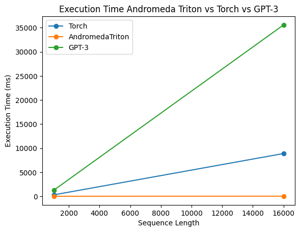

[](https://discord.gg/qUtxnK2NMf)


# Andromeda: Ultra-Fast and Ultra-Intelligent SOTA Language Model 🚀🌌

<div align="center">

[](https://console.algora.io/org/kyegomez/bounties?status=open)
[](https://console.algora.io/org/kyegomez/bounties?status=completed)
[](https://github.com/kyegomez/Andromeda/issues) 
[](https://github.com/kyegomez/Andromeda/network) 
[](https://github.com/kyegomez/Andromeda/stargazers) 
[](https://github.com/kyegomez/Andromeda/blob/main/LICENSE)
[](https://twitter.com/intent/tweet?text=Check%20out%20this%20amazing%20AI%20project:%20Andromeda&url=https%3A%2F%2Fgithub.com%2Fkyegomez%2FAndromeda) 
[](https://www.facebook.com/sharer/sharer.php?u=https%3A%2F%2Fgithub.com%2Fkyegomez%2FAndromeda) 
[](https://www.linkedin.com/shareArticle?mini=true&url=https%3A%2F%2Fgithub.com%2Fkyegomez%2FAndromeda&title=&summary=&source=)

[](https://www.reddit.com/submit?url=https%3A%2F%2Fgithub.com%2Fkyegomez%2FAndromeda&title=Andromeda%20-%20the%20next%20generation%20AI%20shields) 
[](https://news.ycombinator.com/submitlink?u=https%3A%2F%2Fgithub.com%2Fkyegomez%2FAndromeda&t=Andromeda%20-%20the%20next%20generation%20AI%20shields) 
[](https://pinterest.com/pin/create/button/?url=https%3A%2F%2Fgithub.com%2Fkyegomez%2FAndromeda&media=https%3A%2F%2Fexample.com%2Fimage.jpg&description=Andromeda%20-%20the%20next%20generation%20AI%20shields) 
[](https://api.whatsapp.com/send?text=Check%20out%20Andromeda%20-%20the%20next%20generation%20AI%20shields%20%23Andromeda%20%23AI%0A%0Ahttps%3A%2F%2Fgithub.com%2Fkyegomez%2FAndromeda)

</div>


Welcome to Andromeda, The Fastest, Most Creative, and Reliable Language Model Ever Built, train your own verison, conduct inference, and finetune your own verison with simple plug in and play scripts get started in 10 seconds:

## Features

- 💼 Handle Ultra Long Sequences (32,000-200,000+ context lengths)
- ⚡ Ultra Fast Processing (32,000+ tokens in under 100ms)
- 🎓 Superior Reasoning Capabilities

## 🎯 Principles

- **Efficiency**: Optimize with techniques like attention flashing, rotary position encodings, and deep normalization.
- **Flexibility**: Adapt to various tasks and domains for wide applications.
- **Scalability**: Designed to scale with resources and data sizes.
- **Community-Driven**: Thrives on contributions from the open-source community.

---


## 💻 Install

`python3.11 -m pip install --upgrade andromeda-torch`


## Usage
- Forward pass with random inputs
```python
import torch

from andromeda.configs import Andromeda1Billion

model = Andromeda1Billion()

x = torch.randint(0, 256, (1, 1024)).cuda()

out = model(x)  # (1, 1024, 20000)
print(out)
```

- Tokenized inputs
```python
from andromeda_torch import Tokenizer
from andromeda_torch.configs import Andromeda1Billion

model = Andromeda1Billion()
tokenizer = Tokenizer()

encoded_text = tokenizer.encode("Hello world!")
out = model(encoded_text)
print(out)


```


## 📚 Training

1. Set the environment variables:
   - `ENTITY_NAME`: Your wandb project name
   - `OUTPUT_DIR`: Directory to save the weights (e.g., `./weights`)
   - `MASTER_ADDR`: For distributed training
   - `MASTER_PORT` For master port distributed training
   - `RANK`- Number of nodes services
   - `WORLD_SIZE` Number of gpus

2. Configure the training:
   - Accelerate Config
   - Enable Deepspeed 3
   - Accelerate launch train_distributed_accelerate.py

For more information, refer to the [Training SOP](DOCs/TRAINING.md).

---


## Todo
- [ ] Add Yarn Embeddings from zeta


## 📈 Benchmarks

### Speed
- Andromeda utilizes one of the most reliable Attentions ever, flash attention 2.0 Triton. It consumes 50x less memory than GPT-3 and 10x less than LLAMA.



- We can speed this up even more with dynamic sparse flash attention 2.0.

# License
Apache License